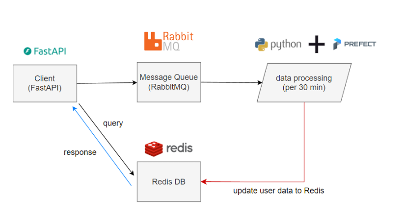

## Sample FastAPI Application with batch-update user data

## How to start

This is for python 3.10

* pip install.

  `python -m pip install -r requirements.txt`
* start service

  `python -m uvicorn main:app --reload`

### 1. FastAPI: Recommendation service

Method: GET

[DOCS: localhost:8000/swagger](http://localhost:8000/swagger)

Parameters:

* userid: string
* itemid: the item that user click(int)

### 2. RabbitMQ: save message from api

Message format(string)

ex. '{"userid": userid, "itemid":itemid}'

### 3. Redis DB: in-memory database(low latency)

Only save data for one day.

### 4 Prefect: DAG Workflow

Modern workflow orchestration for data and ML engineers

Host: localhost:4200
